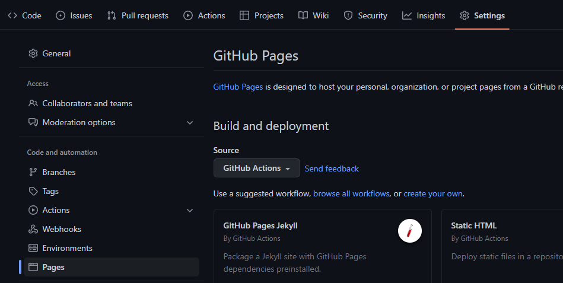

<!-- Imagen centrada del logo -->
<p align="center">
  
</p>

# Formación en Github (By Jordi Sellés Enríquez, Coord. del Grado en Ing. Informática y Sec. del GT de Infraestructuras)

Repositorio de la formación de GitHub de Infraestructuras.

## ¿Qué es GitHub? ¿Qué vamos a aprender?

GitHub es una plataforma de desarrollo colaborativo que se utiliza para alojar proyectos utilizando el sistema de control de versiones Git. Esencialmente, GitHub es una red social para desarrolladores.

Actualmente, GitHub es la plataforma más importante de colaboración para desarrolladores de software.

Generalmente, se aloja código, pero también se puede utilizar para alojar otros tipos de archivos, como documentos, imágenes, vídeos, etc. Además, GitHub permite la creación de wikis, que son páginas web que se pueden editar directamente desde el navegador o el uso de GitHub Pages, que permite alojar páginas web estáticas. Además, tenemos otras herramientas como GitHub Actions, que permite automatizar tareas, o GitHub Packages, que permite alojar paquetes de software.

### ¿Qué vamos a aprender?

En esta formación vamos a aprender a utilizar GitHub para alojar proyectos de software, pero también vamos a aprender a utilizar otras herramientas que nos ofrece GitHub, como GitHub Pages, GitHub Actions y los Proyectos de GitHub.

## GitHub Projects y GitHub Issues

GitHub Projects es una herramienta de gestión de proyectos que nos permite organizar nuestro trabajo en proyectos. Nos permite crear tableros de proyectos, que son listas de tareas, y asignar tareas a personas, etiquetas, fechas de vencimiento, etc.

Los proyectos de GitHub se pueden utilizar para organizar el trabajo de un equipo, pero también se pueden utilizar para organizar el trabajo personal.

Las tareas se pueden crear como _Issues_ vinculadas a un proyecto, con su correspondiente _milestone_ y _label_. Las _issues_ pueden seguir plantillas y tener _checklists_, y se pueden asignar a personas o grupos de personas pertenecientes a la organización.

Hay un tipo de _Issues_ conocidas como _Pull Requests_ que se utilizan para solicitar cambios en un proyecto, como para solicitar que se incorporen cambios en el código desde la rama de desarrollo a la rama principal. Pueden ser revisadas por otros miembros del equipo y aceptadas o rechazadas, además de poder realizar tests automatizados mediante _GitHub Actions_ para comprobar que el código sigue funcionando correctamente.

## GitHub Actions

GitHub Actions es una herramienta que nos permite automatizar tareas. Se pueden crear _workflows_ que se ejecutan cuando se produce un evento, como un _push_ a una rama, un _pull request_ o un _issue_. Los _workflows_ se pueden crear en un fichero de texto plano, en YAML, que se almacena en el repositorio. Los _workflows_ se pueden ejecutar en un entorno de ejecución, que puede ser un contenedor de Docker o una máquina virtual.

### Ejemplo de un workflow

```yaml
name: CI

on:
  push:
    branches: [ main ]
  pull_request:
    branches: [ main ]

jobs:
  build:
    
  runs-on: ubuntu-latest
    
  steps:
    - uses: actions/checkout@v2
    - name: Run a one-line script
  run: echo Hello, world!
    - name: Run a multi-line script
  run: |
    echo Add other actions to build,
    echo test, and deploy your project.
```

Las _actions_ se guardan en el directorio `.github/workflows` del repositorio. En este repositorio tenemos varias _actions_ distintas, que vamos a ver a continuación.

## GitHub Pages

GitHub Pages es una herramienta que nos permite alojar páginas web estáticas en GitHub. Esto se puede hacer de dos formas, mediante una _GitHub Action_ o mediante una rama de un repositorio. En este caso, vamos a ver cómo se puede hacer mediante el uso de una GitHub Action.

Para poder utilizar GitHub Pages en nuestro repositorio mediante el uso de una _action_, tendremos que habilitar la opción de GitHub Pages en el apartado de _Settings_ del repositorio. Look:



Una vez habilitada la opción de GitHub Pages, tendremos que crear un fichero de configuración en el directorio `.github/workflows` del repositorio. Este fichero de configuración se va a llamar `pages.yml` y va a tener el siguiente contenido:

```yaml
name: Publish to GitHub Pages

on:
  # Esta acción se ejecuta cuando se hace un push a la rama main
  push:
    branches: ["main"]
  
permissions:
  # Esta acción necesita permisos para escribir en el repositorio
  contents: read
  pages: write
  id-token: write

jobs:
  # Tarea para hacer un build de la página web
  create-docs:
    environment: Deploy docs
    runs-on: ubuntu-latest
    steps:
      # Empezamos clonando el repositorio en la máquina virtual que se encargará de todo
      # y luego instalamos las dependencias necesarias para hacer el build.
      - name: Checkout
        uses: actions/checkout@v2
      - name: Set up Python
        uses: actions/setup-python@v2
        with:
          python-version: 3.9
      - name: Install dependencies
        run: |
          python -m pip install --upgrade pip
          pip install -r mkdocs-requirements.txt
      # Una vez instaladas las dependencias, hacemos el build de la página web y la subimos
      - name: Build docs
        run: mkdocs build
      - name: Setup Pages
        uses: actions/configure-pages@v2
      - name: Upload artifact
        uses: actions/upload-pages-artifact@v1
        with:
          path: './site'
      - name: Deploy to GitHub Pages
        id: deployment
        uses: actions/deploy-pages@v1
```

Cabe destacar que este fichero de configuración publicará una web que tengamos escrita con ficheros _Markdown_ en el directorio `docs`. Si queremos publicar una web escrita con otro lenguaje, tendremos que modificar el fichero de configuración. A parte, vamos a utilizar una herramienta llamada _mkdocs_ para generar la web a partir de los ficheros _Markdown_, además de utilizar un tema llamado _Material for MkDocs_.

Para poder utilizar _mkdocs_ y _Material for MkDocs_, tendremos que crear un fichero de configuración llamado `mkdocs.yml` en el directorio principal del repositorio. Este fichero de configuración tendrá el siguiente contenido:

```yaml
# mkdocs.yml - https://realpython.com/python-project-documentation-with-mkdocs

site_name: Formación en GitHub
theme:
  name: material
  features:
    - content.code.annotate
  palette:
    primary: blue
    accent: orange
  font:
    text: Exo 2
    code: Hack
  language: es

plugins: 
  - mkdocstrings:
      handlers:
        python:
          options:
            show_source: true
            show_root_heading: true
            heading_level: 3

markdown_extensions:
  - pymdownx.highlight:
      anchor_linenums: 
        true
  - pymdownx.superfences
  - pymdownx.inlinehilite
  - pymdownx.snippets
  - toc:
      permalink: true
      toc_depth: 6
      baselevel: 2
  - tables

nav:
  - Home: home.md

extra: 
  generator: false
```

Además, tendremos que crear un fichero llamado `mkdocs-requirements.txt` en el directorio principal del repositorio. Este fichero de configuración tendrá el siguiente contenido:

```txt
mkdocs
mkdocs-material
mkdocstrings
mkdocstrings-python
```

Simplemente, cuando llegue un _push_ a la rama _main_, se ejecutará la _action_ que hemos creado y se publicará la web en GitHub Pages.

## Code Testing

En este apartado vamos a ver cómo podemos utilizar GitHub Actions para ejecutar tests en nuestro repositorio. Para ello, vamos a utilizar la herramienta _unittest_.

En la raiz del repositorio tenemos una carpeta llamada `src` que contiene la clase `Triangulo`. Esta clase tiene un método llamado `tipoTriangulo` que nos dice el tipo de triángulo que es, en función de la longitud de los lados que le enviemos por parámetros. Por otra parte, tenemos una carpeta llamada `tests` que contiene los tests que vamos a ejecutar para comprobar que el método `tipoTriangulo` funciona correctamente.

Si nos situamos en la raiz del repositorio, podemos ejecutar los tests con el siguiente comando:

```bash
python -m unittest discover -s tests -p "test*.py"
```

Este comando nos va a ejecutar todos los tests que estén en el directorio `tests` y que empiecen por `test`. Si queremos ejecutar un test en concreto, podemos ejecutar el siguiente comando:

```bash
python -m unittest tests/test_Triangulo.py
```

Para poder ejecutar los tests con GitHub Actions, tendremos que crear un fichero de configuración en el directorio `.github/workflows` del repositorio. Este fichero de configuración se va a llamar `tests.yml` y va a tener el siguiente contenido:

```yaml
name: Tests

on:
  push:
    branches: ["main"]
  pull_request:
    branches: ["main"]

jobs:
  test:
    runs-on: ubuntu-latest
    steps:
      - uses: actions/checkout@v2
      - name: Set up Python
        uses: actions/setup-python@v2
        with:
          python-version: 3.9
      - name: Install dependencies
        run: |
          python -m pip install --upgrade pip
          pip install -r requirements.txt
      - name: Run tests
        run: python -m unittest discover -s tests -p "test*.py"
```

Este fichero de configuración va a ejecutar los tests cada vez que se haga un _push_ a la rama _main_ o cuando se haga un _pull request_ a la rama _main_. Además, va a ejecutar los tests en una máquina virtual con Ubuntu.

Cabe destacar que será necesario tener un fichero llamado `requirements.txt` en la raiz del repositorio. Este fichero de configuración tendrá el siguiente contenido:

```txt
unittest
```

