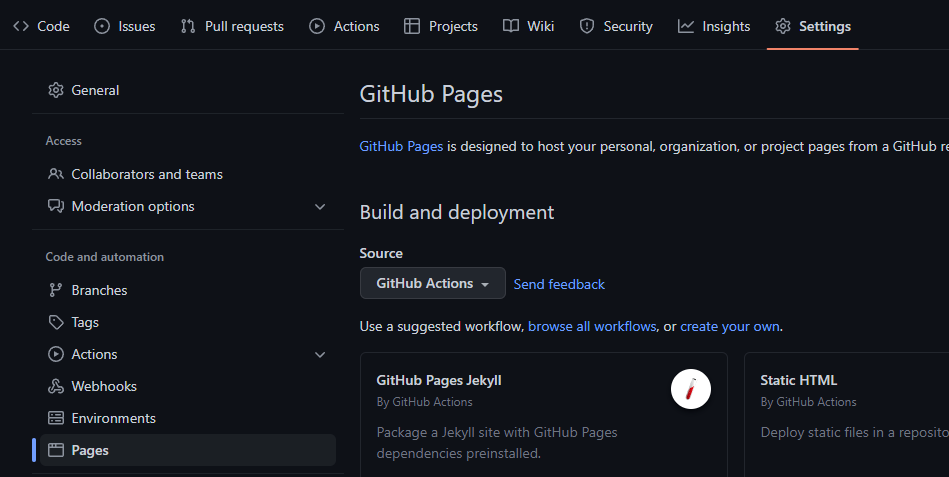

# GitHub Actions

GitHub Actions es una herramienta que nos permite automatizar tareas. Se pueden crear _workflows_ que se ejecutan cuando se produce un evento, como un _push_ a una rama, un _pull request_ o un _issue_. Los _workflows_ se pueden crear en un fichero de texto plano, en YAML, que se almacena en el repositorio. Los podemos ejecutar en un entorno de ejecución, que puede ser un contenedor de Docker o una máquina virtual.

## Ejemplo de un workflow

```yaml
name: CI

on:
  push:
    branches: [ main ]
  pull_request:
    branches: [ main ]

jobs:
    build:
        
    runs-on: ubuntu-latest
        
    steps:
        - uses: actions/checkout@v2
        - name: Run a one-line script
    run: echo Hello, world!
        - name: Run a multi-line script
    run: |
        echo Add other actions to build,
        echo test, and deploy your project.
```

En este repositorio vamos a tener varias _actions_ distintas, que vamos a ver a continuación.

## GitHub Pages

GitHub Pages es una herramienta que nos permite alojar páginas web estáticas en GitHub. Esto se puede hacer de dos formas, mediante una _GitHub Action_ o mediante una rama de un repositorio. En este caso, vamos a ver cómo se puede hacer mediante el uso de una GitHub Action.

Para poder utilizar GitHub Pages en nuestro repositorio mediante el uso de una _action_, tendremos que habilitar la opción de GitHub Pages en el apartado de _Settings_ del repositorio. Look:



Una vez habilitada la opción de GitHub Pages, tendremos que crear un fichero de configuración en el directorio `.github/workflows` del repositorio. Este fichero de configuración se va a llamar `pages.yml` y va a tener el siguiente contenido:

```yaml
name: Publish to GitHub Pages

on:
  # Esta acción se ejecuta cuando se hace un push a la rama main
  push:
    branches: ["main"]
  
permissions:
  # Esta acción necesita permisos para escribir en el repositorio
  contents: read
  pages: write
  id-token: write

jobs:
  # Tarea para hacer un build de la página web
  create-docs:
    environment: Deploy docs
    runs-on: ubuntu-latest
    steps:
      # Empezamos clonando el repositorio en la máquina virtual que se encargará de todo
      # y luego instalamos las dependencias necesarias para hacer el build.
      - name: Checkout
        uses: actions/checkout@v2
      - name: Set up Python
        uses: actions/setup-python@v2
        with:
          python-version: 3.9
      - name: Install dependencies
        run: |
          python -m pip install --upgrade pip
          pip install -r mkdocs-requirements.txt
      # Una vez instaladas las dependencias, hacemos el build de la página web y la subimos
      - name: Build docs
        run: mkdocs build
      - name: Setup Pages
        uses: actions/configure-pages@v2
      - name: Upload artifact
        uses: actions/upload-pages-artifact@v1
        with:
          path: './site'
      - name: Deploy to GitHub Pages
        id: deployment
        uses: actions/deploy-pages@v1
```

Cabe destacar que este fichero de configuración publicará una web que tengamos escrita con ficheros _Markdown_ en el directorio `docs`. Si queremos publicar una web escrita con otro lenguaje, tendremos que modificar el fichero de configuración. A parte, vamos a utilizar una herramienta llamada _mkdocs_ para generar la web a partir de los ficheros _Markdown_, además de utilizar un tema llamado _Material for MkDocs_.

Para poder utilizar _mkdocs_ y _Material for MkDocs_, tendremos que crear un fichero de configuración llamado `mkdocs.yml` en el directorio principal del repositorio. Este fichero de configuración tendrá el siguiente contenido:

```yaml
# mkdocs.yml - https://realpython.com/python-project-documentation-with-mkdocs

site_name: Formación en GitHub
theme:
  name: material
  features:
    - content.code.annotate
  palette:
    primary: blue
    accent: orange
  font:
    text: Exo 2
    code: Hack
  language: es

plugins: 
  - mkdocstrings:
      handlers:
        python:
          options:
            show_source: true
            show_root_heading: true
            heading_level: 3

markdown_extensions:
  - pymdownx.highlight:
      anchor_linenums: 
        true
  - pymdownx.superfences
  - pymdownx.inlinehilite
  - pymdownx.snippets
  - toc:
      permalink: true
      toc_depth: 6
      baselevel: 2
  - tables

nav:
  - Home: home.md

extra: 
  generator: false
```

Además, tendremos que crear un fichero llamado `mkdocs-requirements.txt` en el directorio principal del repositorio. Este fichero de configuración tendrá el siguiente contenido:

```txt
mkdocs
mkdocs-material
mkdocstrings
mkdocstrings-python
```


